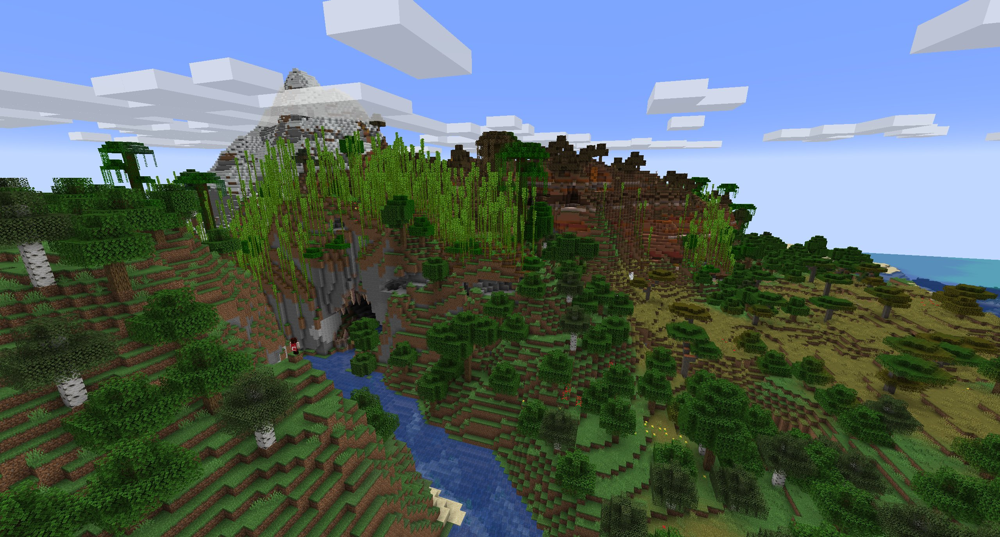
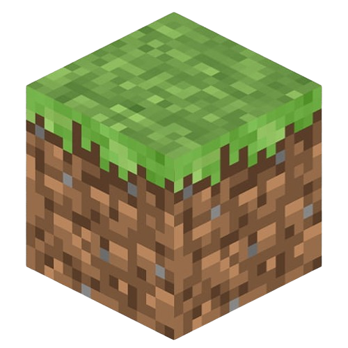

# Minecraft Mods
A website about minecraft and minecraft mods. Made for my Step-It
final project and for my school website project.

It has multiple pages and uses FastAPI with Uvicorn to serve the 
website. Has its own simple CMS (content management system) that
uses markdown.

You can run it as-is and view my "Minecraft Mods" website or you
can change the content and use the API as a CMS for your own website


## Table of contents
- [Minecraft Mods](#minecraft-mods)
    - [Table of contents](#table-of-contents)
    - [Running](#running)
        - [Requirements](#requirements)
        - [Launching the API](#launching-the-api)
    - [Adding pages](#adding-pages)
    - [Markdown formatting](#markdown-formatting)
        - [Yaml data](#yaml-data)
        - [Full example of a markdown file](#full-example-of-a-markdown-file)
    - [Default html](#default-html)
        - [Example ```404.html```](#example-404html)
        - [Example ```index.html```](#example-indexhtml)
        - [Example ```head.html```](#example-headhtml)
        - [Example ```header.html```](#example-headerhtml)
    - [Css](#css)
    - [Javascript](#javascript)
    - [Resources](#resources)
    - [Cache](#cache)

## Running
``` bash
pip install -r requirements.txt
./run.bat
```

### Requirements
Before running the project, you need these dependencies installed:
- Python 3.x
- Python packages listed in ```requirements.txt```

To install python packages you can use one of the following commands:
``` bash
pip install -r requirements.txt
pip3 install -r requirements.txt
```

### Launching the API
The bash file ```run.bat``` contains the command to run it. 
Alternatively you can use uvicorn or any other tool to run the
FastAPI api.

Here are various examples of launching the API using uvicorn:
``` bash
uvicorn main:app
uvicorn main:app --reload
uvicorn main:app --port 5000
uvicorn main:app --port 5000 --reload
uvicorn main:app --port 5555 --host 127.0.0.1
uvicorn main:app --port 5555 --host 127.0.0.1 --reload
```

The default ```run.bat``` starts the API with uvicorn on port 5000.

## Adding pages
To add a page you can just add a new markdown file to the ```/pages``` folder. Make sure to follow the [markdown formatting](#markdown-formatting) that is required.

## Markdown formatting
Each markdown file (page) needs to start with yaml data and after that it has markdown for the page. 
### Yaml data
``` yaml
---
title: Website Title
background: background.jpg
path: /page
customCSS:
    - someFile.css
    - otherFile.css
customJS:
    - someFile.js
    - otherFile.js
---
```
The ```title``` parameter sets the website title. The website 
title is the ```<title></title>``` html element

```background``` specifies the image to be used as the background 
image. It starts by default in the ```/resources``` folder so if 
the background image is in ```/resources/background.jpg``` all you 
need is ```background.jpg```.

The ```path``` parameter is used to specify the website path for 
this page. so if you want your page to be at ```localhost:5000/page/somePage``` you need to specify ```/page/somePage```.

The last two parameters: ```customCSS``` and ```customJS``` are 
optional and specify the name of the css/js file you want to add.
For example if you want to add ```/js/someJS.js``` and ```/css/someCSS.css``` you specify:
``` yaml
customCSS:
    - someCSS.css
customJS:
    - someJS.js
```
If you don't want to use extra css or js you don't have to and you
can just not specify it. If you specify extra css the css file path
starts in the ```/css``` folder and for js it is in the ```/js``` folder (as you saw in the example)

### Full example of a markdown file
```
---
title: About Minecraft
background: terrain.jpg
path: /about
customCSS:
    - aboutMc.css
---

# About Minecraft
Minecraft is a block game.

## Header 2
Some text for header2

## Another header
Some more text
```

## Default html
The ```/html``` folder is contains the default html files:
- ```404.html``` - The html that is used for the 404 page
- ```head.html``` - The default head data that is injected 
                    into every page
- ```header.html``` - The header that is in every page
- ```index.html``` - The html that is used for the index page

The ```index.html``` and ```404.html``` don't contain the whole
website. They only contain the ```<main>...<main>``` part. In
these files you also need to include the background image link. Example of such link is:
 ``````

The head is in ```head.html``` and the header is in ```header.html```.

### Example ```404.html```
``` html

<main style="height: min-content; overflow: hidden;">
    <h1>Oops!</h1>
    <h2>You've encountered a broken link.</h2>
    <h3>It seems like an Enderman stole this page. Please check if you've entered the correct link and try again.</h3>
</main>
```

### Example ```index.html```
``` html

<main style="height: min-content; overflow: hidden;">
    <h1>Minecraft Mods</h1>
    <h3><a href="/info">Basic Information</a></h3>
    <h3><a href="/mod-info">How They Work</a></h3>
    <h3><a href="/get-mods">Where to Get Them</a></h3>
    <h3><a href="/use-mods">How to Use Them</a></h3>
    <h3><a href="/mod-list">My Favorites</a></h3>
</main>
```


### Example ```head.html```
``` html
<meta charset="UTF-8">
<meta name="viewport" content="width=device-width, initial-scale=1.0">
<script src="https://ajax.googleapis.com/ajax/libs/jquery/3.5.1/jquery.min.js"></script>
<link rel="icon" type="image/x-icon" href="/resources/favico.ico">
```


### Example ```header.html```
``` html
<header>
    <!-- https://unused-css.com/blog/animated-dropdown-menu/ -->
    <nav>
        <h1><a href="/">Minecraft Módy</a></h1>
        <ul class="nav-bar">
          <li class="nav-bar_item dropdown">
            <div id="navMenu"><a href="#"></a></div>
            <ul class="project">
                <li class="drop-item"><h2 class="top-padding-10">Módy</h2></li>
                <li class="drop-item intractable-drop-item"><a href="/info">Info</a></li>
                <li class="drop-item intractable-drop-item"><a href="/mod-info">Fungovanie</a></li>
                <li class="drop-item intractable-drop-item"><a href="/get-mods">Získanie</a></li>
                <li class="drop-item intractable-drop-item"><a href="/use-mods">Použitie</a></li>
                <li class="drop-item intractable-drop-item"><a href="/mod-list">Moje obľúbené</a></li>
                <li class="drop-item"><h2>Ostatné</h2></li>
                <li class="drop-item intractable-drop-item"><a href="/links">Odkazy</a></li>
            </ul>
          </li>
        </ul>
      </nav>
</header>
```

## Css
All css files are stored in the ```/css``` folder.

Default css files are:
- ```404.css``` - The css for the 404 page
- ```index.css``` - The css for the index page
- ```style.css``` - The css stylesheet used for all pages

## Javascript
All js files are stored in the ```/js``` folder.

The only default js file is ```script.js```. It is used in all
pages.

## Resources
All resources are stored in the ```/resources``` folder.

## Cache
The ```cachedPages``` folder is used for cache by default. 

What is cached:
- Html files for all pages that will be served
- Sha256 hashes of all the markdown pages
- List of all pages that are cached

You don't need to create the cache folder and you don't need to
worry about deleting it or keeping it up to date. On startup the
program automatically handles everything.

If any markdown file is modified or added it automatically updates
the cache and serves the new page.
